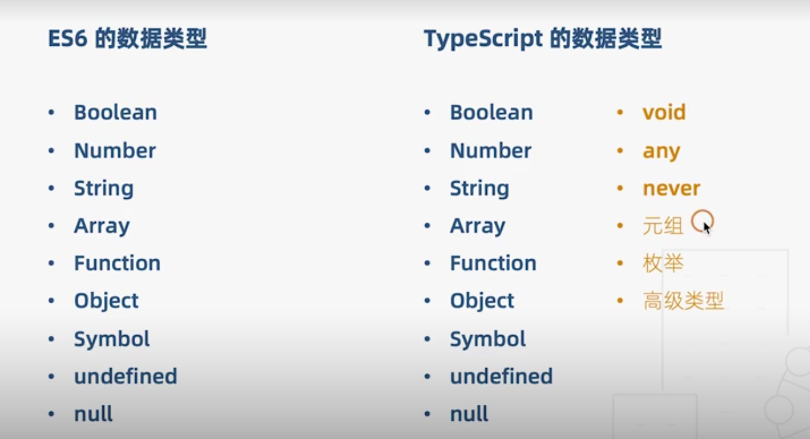

# TypeScript 实战

[toc]

## TS 是什么?

[官网](https://www.tslang.cn/docs/home.html)

[基础解读](https://juejin.im/post/5cb588aa51882532c1535046)


### 强弱类型的语言

[在线编码平台](https://tool.lu/coderunner/)

> **强类型语言** : 不允许改变变量的数据类型, 除非进行强制类型转换。
>
> **弱类型语言** : 变量可以被赋值给不同的数据类型。

```java
class Untitled {
	public static void main(String[] args) {
		int x = 20;
		boolean y = true;
		x = y;
	}
}
// ==>
sandbox> timed out after 5s
Untitled.java:5: error: incompatible types: boolean cannot be converted to int
		x = y;
		    ^
1 error
Error: Could not find or load main class Untitled
Caused by: java.lang.ClassNotFoundException: Untitled
sandbox> exited with status 0
```

类型转换

```java
class Untitled {
	public static void main(String[] args) {
		int x = 20;
		char z = 'a';
		x = z;
		System.out.println(x);
	}
}
// ==>
97
```


### 动静态类型语言

> **静态类型语言** ： 在编译阶段即确定了所有变量类型
>
> **动态类型语言**：运行阶段确定所有变量类型


总之，静态比动态的效率高。


## 基础

### 构建基础的运行环境

```shell
npm i typescript -g
mkdir ts-action
cd ts-action
npm init -y
tsc --init
```

`tsc --init` : 初始化` ts.config.json`

初始化目录结构

```
├── package.json
├── src
│   └── index.ts
└── tsconfig.json
```

首次编译 `tsc ./src/index.ts`

```ts
// index.ts
let str: string = 'foo';

// => index.js 
var str = 'foo';
```

搭建一下[基础的 ts 环境](https://github.com/Kujo-Jotaro-AAAAA/typescript-base-env.git)


### 基本类型



```ts
// 原始类型
let bool: boolean = true
let num: number | undefined | null = 123
let str: string = 'abc'
// str = 123

// 数组
let arr1: number[] = [1, 2, 3]
let arr2: Array<number | string> = [1, 2, 3, '4']

// 元组
let tuple: [number, string] = [0, '1']
// tuple.push(2) // 可以 push
// console.log(tuple)
// tuple[2] // 但是获取会报错

// 函数
let add = (x: number, y: number) => x + y
let compute: (x: number, y: number) => number
compute = (a, b) => a + b

// 对象
let obj: { x: number, y: number } = { x: 1, y: 2 }
obj.x = 3

// symbol
let s1: symbol = Symbol()
let s2 = Symbol()
// console.log(s1 === s2)

// 所有类型的子类型 undefined, null
// 一旦指定, 无法再改为其他类型
let un: undefined = undefined
let nu: null = null
num = undefined
num = null

// void
let noReturn = () => {}

// any
let x
x = 1
x = []
x = () => {}

// never
let error = () => {
    throw new Error('error')
}
let endless = () => {
    while(true) {}
}
```


### 枚举类型

> 一组有名字的常量

通常是为了标记一些硬编码的变量, 使项目更具维护性。

```js
// 硬编码, 天长日久没有文档难以维护
if (a === 1) { }
else if (a === 2) {}
```

#### 数字枚举

数字枚举对应的值会递增 `+ 1`

```ts
// 数字枚举
enum Role {
    Reporter, // 0
    Developer = 2,
    Maintainer, // 3
    Owner, // 4
    Guest
}
```

反向映射实现枚举的功能

```js
var Role;
(function (Role) {
    Role[Role["Reporter"] = 1] = "Reporter";
    Role[Role["Developer"] = 2] = "Developer";
    Role[Role["Maintainer"] = 3] = "Maintainer";
    Role[Role["Owner"] = 4] = "Owner";
    Role[Role["Guest"] = 5] = "Guest";
})(Role || (Role = {}));
```


```ts
// 字符串枚举
enum Message {
    Success = '恭喜你，成功了',
    Fail = '抱歉，失败了'
}

// 异构枚举, 一个枚举中有不同的类型, 一般不推荐使用
enum Answer {
    N, // 0
    Y = 'Yes'
}

// 枚举成员
// Role.Reporter = 0
enum Char {
    // const member
    a,
    b = Char.a,
    c = 1 + 3,
    // 没有给确定值的 叫 computed member (计算枚举)
  	// 计算枚举后一个枚举一定要赋值
    d = Math.random(),
    e = '123'.length,
    f = 4
}

// 常量枚举
const enum Month {
    Jan,
    Feb,
    Mar,
    Apr = Month.Mar + 1,
    // May = () => 5
}
let month = [Month.Jan, Month.Feb, Month.Mar];
// 编译后枚举的声明删去, 留下 var month= [0,1,2,3]

// 枚举类型
enum E { a, b }
enum F { a = 0, b = 1 }
enum G { a = 'apple', b = 'banana' }

let e: E = 3
let f: F = 3
// e === f 即使值相等, 编译也会报错。

let e1: E.a = 3
let e2: E.b = 3
let e3: E.a = 3
// e1 === e2 编译报错
// e1 === e3 ok

// 指定为 G 枚举, 取值只能在 G 枚举范围内了
let g1: G = G.b
let g2: G.a = G.a // G.a 取值只能为 G.a, 直接指定 apple 都不行

```

## 接口interface

`interface ` 字段定义接口

```ts
interface O {
    id: number;
}
interface Os {
    list: O[]
}
function render(os: Os) {
    os.list.filter(item => true);
}


```

### ts 检查

```ts
// 1.使用对象字面量, 会触发校验
render({
    list : [{
        id: 1,
        name: 'string'
    }]
});

// 2.赋值后, 不会
const os = {
    list : [{
        id: 1,
        name: 'string' // 多余的字段并不会报错
    }]
}
render(os);

// 3. 字符串索引签名
// 更改接口 O
interface O {
    id: number;
  	// 表示能兼容其他任意的 key
  	[propsName: string]: any;
}
```


### 断言

```ts
// 类型断言, 告知 ts 具体类型, 也不会触发校验 使用 as 
render({
    list : [{
        id: 1,
        name: 'string'
    }]
} as Os);

// 类型断言第二种写法, 不推荐 <Os>
render(<Os>{
    list : [{
        id: 1,
        name: 'string'
    }]
});
```


### 可选属性

```ts
interface O {
    id: number;
  	age?: number;
}
```


### 只读

表示该属性只能获取, 无法重新赋值

```ts
interface O {
    id: number;
  	readonly age?: number;
}
```


### 定义函数

1. 可选参数, 必须为形参的最末位。
2. 一旦指定了默认值, 该形参就不可指定为可选

```ts
// 1. 
// let add : (x: number, y:number) => number;
// 2.
// interface Add {
  // (x: number, y:number) : number
// }
// 3.type 定义类型别名
type Add  = (x: number, y:number) => number;
// 注意：以上都只是定义了类型, 并没有真正实现函数

// 实现
let add: Add = (x, y) => x + y;
add(1,2);

// error
function Demo(x?: number = 1){}
// error
function Demo(x: number, y?:number, z:number){}
// 参数个数未知
function Demo(x: number, ...rest: number[]) {}

```


#### 混合模式

```ts
interface Lib {
  () : void;
  something: () => void;
  id: number;
};
// 即使全部申明了也会报错, 
// let lib: Lib = () => {};
let lib: Lib = (() => {}) as Lib; // 只能用断言抢救一下
lib.id = 1;
lib.something = () => {}
```

#### 函数的重载

**重载**: 一个函数根据传入的参数个数|类型不同,有不同的表现。

`TS`中必须将要重构函数的所有类型都申明一遍

然后用包含了这些声明的函数实现。

```ts
interface Demo{
  (a: number) : number;
}
interface Demo{
  (a: string) : string;
}
// any 类型包含了声明的类型
const demo: Demo = function (a: any): any {
  if (a instanceof Number) return 1;
  if (a instanceof String) return 'a';
}
```

### 继承

```ts
interface Jonathan {
  attribute: 'gentry'
}
interface Joseph extends Jonathan{
  run: () => void
}
interface Jotaro extends Joseph, Jonathan {
  invincible: boolean;
}
```


[第二节: Class&高级类型](./readme/02-10~21.md)

