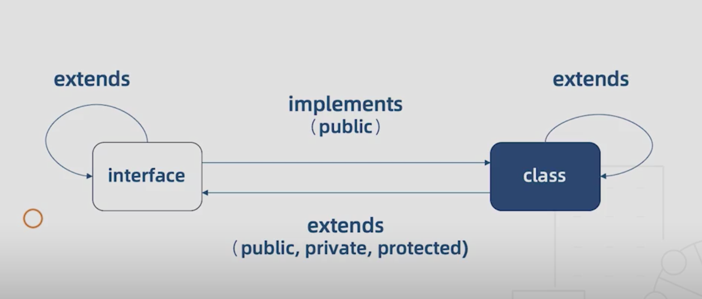

# 第二节 Class 与高级类型

[toc]

## 类

```ts
class Dog {
  constructor(name: string) {
    this.name = name;
  }
  // 在构造函数中初始化的属性, 可以不指定默认值
  // name: string;
  name: string = '';
  eat(){console.log('bone');
  }
}
// 对象的方法绑定在原型上
console.log(Dog.prototype);
// 对象的属性会绑定在实例上
const Husky = new Dog('FeiYang');
console.log(Husky);
```

### 成员修饰符

`public` : 公共。默认类型,可以不写。

`static`: 只有自身和子类能通过类名来访问。

```ts
class Animal {
  constructor() {}
  static age: number = 18;
}

Animal.age
const animal = new Animal();

// error
// animal.age 

class Cat extends Animal {
  constructor(parameters) {
    super();
  }
  sayAge() {
    // error
    console.log(this.age);
  }
}

// success
console.log(Cat.age)
```


`private` : 私有。只能被类本身调用, 子类、实例均无法使用。

```ts
// 可以给构造函数加 private , 那么继承和实例化都会报错
class Animal {
   private constructor() {
    
  }
}
class Cat extends Animal { // error
  constructor() {
    super();
  }
}
const animal = new Animal() // error
```

`protected`: 受保护的。只能被自身、子类调用

```ts
class Animal {
  // 如果给构造函数加 protected , 那么只能被子类继承，不能被实例化
  // 相当于写了一个基类
  // protected constructor() {}
  constructor() {}
  protected leg: number = 4;
}
class Cat extends Animal {
  constructor() {
    super();
  }
  leg: number = 2;
}
const animal = new Animal();
animal.leg // error
```

`readonly` : 只读。

- 构造函数的参数也可以使用修饰符

```ts
class Animal {
  constructor(public name: string) {}
  // 可以省略, name 直接成为实例的属性了
  // name: string = ''
}
```


### 抽象类

> 关键字: `abstract`
>
> 可以被继承，无法被实例化的类。
>
> 方法也可以被抽象, 表示该方法在子类中去实现。

```ts
abstract class AbsAnimal {
  run(){}
  abstract eat() : void;
}
// error
// const animal = new AbsAnimal()

// correct
class Cat extends AbsAnimal {
  constructor(){
    super();
  }
  eat() { console.log('swallow') }
}
const cat = new Cat();
cat.run();
cat.eat();
```

`TS`只是在静态编译的时候检查实例化抽象类。

```js
var AbsAnimal = /** @class */ (function () {
    function AbsAnimal() {
    }
    AbsAnimal.prototype.run = function () { };
  	// 抽象的 eat 方法直接没写
    return AbsAnimal;
}());
// 打包后照样可以实例。
const animal = new AbsAnimal();
```

### 多态

> ~~多态是同一个行为具有多个不同表现形式或形态的能力。~~
>
> 同样是吃, 猫吃鱼，狗吃肉。

```ts
abstract class AbsAnimal {
  run(){}
  abstract eat() : void;
}
class Cat extends AbsAnimal {
  constructor(){
    super();
  }
  eat() { console.log('fish') }
}
const cat = new Cat();
class Pig extends AbsAnimal {
  eat() {console.log('&^%$*^%');
  }
}
const pig = new Pig();
cat.eat(); // fish
pig.eat(); // 啥都吃
```

### 特殊的`this`类型

在方法中返回`this`可以实现链式调用。

```ts
class WorkFlow {
  step1() {
    return this;
  }
}
class MyFlow extends WorkFlow {
  constructor() {
    super()
  }
  next() {
    return this;
  }
}
const flow = new MyFlow();
flow.next().step1().next().step1().next().step1().next();
```


## 类与接口

### 实现

> 关键字`implements`
>
> 接口定义一个类的基础实现。
>
> 接口只能约束类的公有成员。

```ts
interface Animal {
  name: string;
  run: () => void;
}
class Ox implements Animal {
  constructor(){
    
  }
  name: string = '乔丹';
  run() {
    console.log('飞快');
  }
  // 不影响类的拓展
  money: number = 999999999999;
}
```

### 接口与类可以互相继承、互相实现

```ts
class Auto {
  state = 1
}
// 接口继承类
interface AutoInterface extends Auto {}
// 类实现接口
class C implements AutoInterface {
  state: number = 1;
}
// 子类继承后实现接口
class Bus extends Auto implements AutoInterface {}
```




## 泛型

> 不预先确定数据类型, 使用时才可知具体类型。
>
> 与函数的参数相似, 代表着定义类型的参数

- `any VS <T>` 

```ts
function log1(name: any):any {
  return name;
}
// VS
function log2<T>(value: T): T {
    console.log(value);
    return value;
}
log1('XiaoMing');
// log2<string>('XiaoMing');
log2('XiaoMing')
```


```ts
// 泛型函数定义
type Log = <T>(value: T) => T
let myLog: Log = log2

// 泛型接口
// 只对 Log 函数有泛型约束 
interface Log {
     <T>(value: T): T; 
}
// 整个接口都会被泛型约束
interface Log<T> {
     (value: T): T
}
let myLog: Log<number> = log2;

// 指定泛型默认值
interface Log<T = 'string'> {
     (value: T): T
}
let myLog: Log = log2;
```

