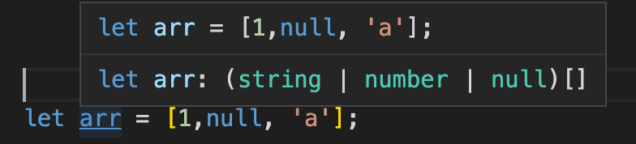
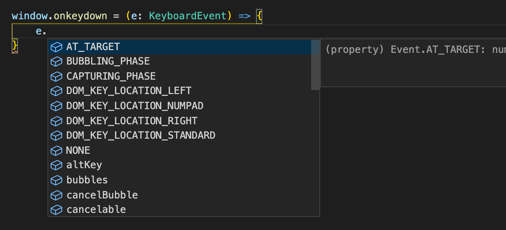
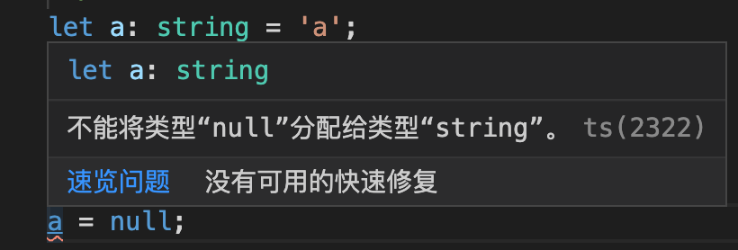
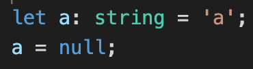
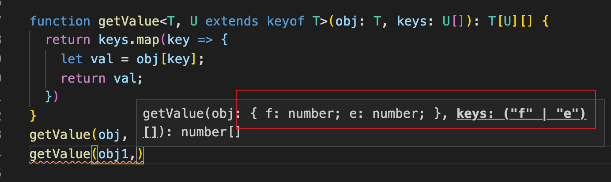

# 第三节: 类型检查机制&高级类型

## 类型检查机制

`TS`会根据一定的规则, 自动推断出当前使用的类型, 分为: **基础类型**、**最佳通用类型**、**上下文类型**。

- 基础类型推断

```ts
let a = 1;
// => 等价于
// let a: number = 1;
let b = false;
// let b:boolean = false;
```

- 最佳通用类型

当有两个以上类型时, 会自动推断为囊括这些类型的定义。

```ts
let arr = [1,null, 'a'];
```



`tsconfig.json`关闭[严格空校验模式](https://segmentfault.com/a/1190000007002883), 会让 `null` 和其他类型兼容。

`strictNullChecks: false` 


以上两种推断，都是以值来推断类型(右向左推断)。

- 上下文推断

通常发生在函数绑定中, 以绑定的事件来推断出参数具有的属性(左→右)。

~~视频里是不用加`KeyboardEvent`但我就是没有🐶~~




### 类型断言

明确知道数据的类型

```ts
interface API {
    id: number;
}
let api = {} as API;
```


### 兼容类型

**兼容**: `A` 兼容 `B`, `A` 可以赋值给 `B`

当一个类型A 可以赋值给另一个类型 `B` 时, 就叫做兼容类型。

最基本的, 默认配置下 `string` 无法赋值给 `null`。



当设置为 `"strictNullChecks": false`



- 接口兼容

1. 在例子中, `Y` 接口包含了 `X` 接口的所有类型, `x` 可以赋值给 `y`

2. 字段少的兼容字段多的

```ts
interface X {
  a: any;
}
interface Y {
  a: any;
  b: any;
}
let x:X = {a: 1};
let y:Y = {a: 1, b: 1};
// ok
x = y

// error
y = x
```


### 函数兼容
- 参数个数
1. 参数多的兼容参数少的
2. 固定参数兼容可选和剩余参数
3. 可选参数不兼容剩余参数
   + 可设置 `"strictFunctionTypes": false`,让其兼容
4. 剩余参数可以兼容固定参数和可选参数

- 参数类型
1. 参数类型必须匹配
2. 当参数是对象时, **字段多的兼容字段少的** 与接口判断规则是相反的。

- 返回值类型

1. 参数少的兼容参数多的
2. 参数类型范围多兼容范围少的

```ts
// demo: 参数个数兼容
let x = (x: number, y: number, z: number) => {};
let y = (x: number, y?: number) => {};
let z = (...rest: number[]) = {};
x = y;
x = z;
y = x; // error 
y = z;
z = x;
z = y;
```

```ts
// demo:参数类型
let x = (x: number) => {};
let y = (y: number) => {};
// let y = (y: string) => {}; error 类型不兼容
// let y = (y: any) => {};
x = y;
```

```ts
interface XParams {
  a: number;
}
interface YParams {
  a: number;
  b: number;
}
let x = (x: XParams) => {};
let y = (y: YParams) => {};
x = y; // error 与接口兼容不一样哦, 这里是多的兼容少的
y = x;
// 「 返回值类型 」
let x = () => ({x: ''});
let y = () => ({y: 1});
let z = () => ({y: 1});

// error
x = y
y = z;
```

### 类型保护

~~`TS`能够在特定的区块中保证变量属于某种确定类型~~

自己写类型检查,告诉 `TS`这变量是啥类型。

`is` 类型位词。使用:  **参数 `is` 类型** 

```ts
class Java {
  sayJava(){}
}
class JavaScript {
  sayJavaScript(){}
}
function getlang(param: Java | JavaScript) {
  // error 
  // param.sayJava

  // 1. instanceof
  // if (param instanceof Java) {
  //   param.sayJava
  // } else {
  //   param.sayJavaScript
  // }

  // 2. in
  // if ('sayJava' in param) {
  //   param.sayJava
  // }

  // 4 实现
  if (isJava(param)) {
    param.sayJava()
  }
}
// 3. typeof
function getType(x: string | number) {
  if ( typeof x === 'string') {
    console.log(x.length);
  } else {
    console.log(x.toFixed(2));
  }
}
// 4 通过类型位词 is 自己实现判断函数
function isJava(lang: Java | JavaScript): lang is Java {
  return (lang as Java).sayJava !== undefined
}
```

### 交叉类型

`&` 将两个类型组合起来, 声明后要实现两个类型都有的方法。

```ts
interface Str {
  x: string;
}
interface Num {
  y: number;
}
// 取两者并集
const obj : Str & Num = {
  x: 'a',
  y: 1
}
// 如果是 class , 取两者的交集
```

### 联合类型

```ts
let a: number | string = 'a';
// 字面量类型
let b: 'x' | 'y' | 'z' = 'x';
let c: 1 | 2 | 3 = 1;
```

### ☆索引类型

`keyof`: 索引类型查询操作符

`T['key']`: 索引访问操作符

泛型约束`T extends U`

```ts
interface Obj {
  a: number,
  b: number,
}
const obj1 = {
  a: 1,
  b: 2
}
const obj2 = {
  f: 1,
  e: 2
}
function getValue(obj: any, keys: string[]) {
  return keys.map(key => {
    let val = obj[key];
    return val;
  })
}
getValue(obj1, ['a']); // ok
getValue(obj2, ['a']); // obj2 里没有 a, 报错才对
```

1.将参数 `obj` 指定为一个泛型`T`。

2.指定第二个泛型`U` 约束为`T` 的索引。

3.将返回值指定为`T[U]`的索引符数组。

```ts
// 索引类型应用
function getValue<T, U extends keyof T>(obj: T, keys: U[]): T[U][] {
  return keys.map(key => {
    let val = obj[key];
    return val;
  })
}
```



### 映射类型

更多类型,`⌘ + 左键` 去它内库中看

- 同态

已原类型为基础, 生成新类型，不会增加新属性。

```ts
interface Obj {
  a: string;
  b: number;
  c: boolean;
}

// 生成全部只读的类型
type ReadonlyObj = Readonly<Obj>;

// 生成全部可选的类型
type PartialObj = Partial<Obj>;

// 抽取某几个属性
type PickObj = Pick<Obj, 'a' | 'b'>;
```

- 非同态

不以原类型为基础的, 批量生成属性。

```ts
type RecordObj = Record<'d' | 'e', string>;
```

### 条件类型

语法:` T extends U ? x : y`

```ts
type ConditionType<T> = T extends string ? 'a' : 1;
type ConditionStr = ConditionType<string>
type ConditionNum = ConditionType<number>
```


[第四篇：工程化](./04-22~31.md)


