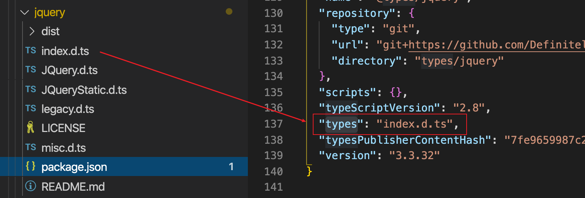
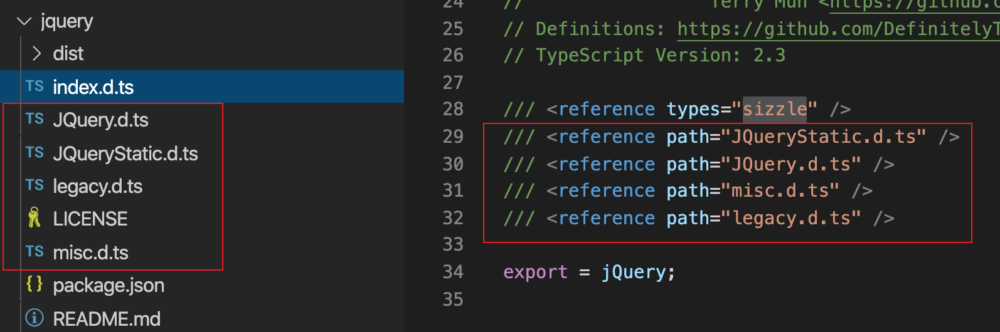
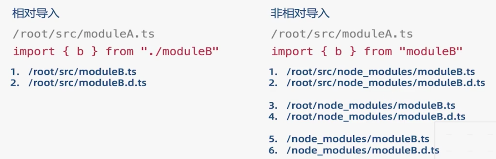
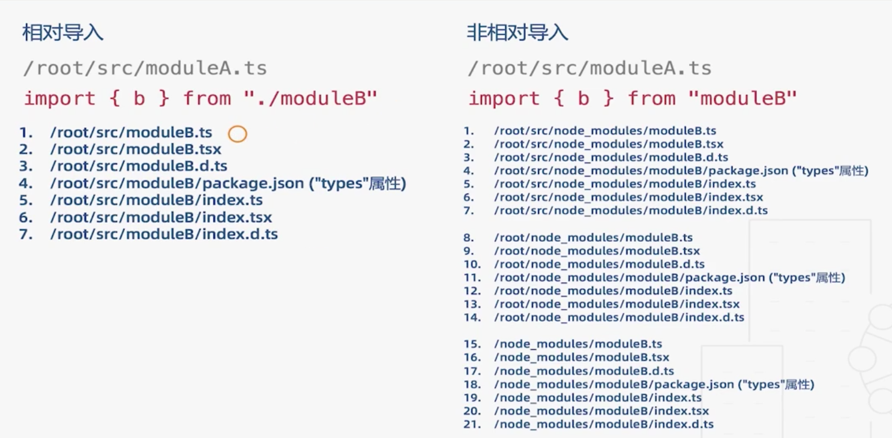

# 第四篇： 工程化(一)

[toc]

## 模块兼容性处理

`es6`模块化允许一个模块有一个顶层导出，同时还能单独导出其他模块。

`commonJs` 只允许导出一个顶层或者其他单独模块。

当两种模块互相导入时就会冲突, 在。`commonJs` 必须通过 `default`属性来调用 `es6` 的顶层导出

- `es6` 

```ts
// a.ts
export let str = 'str';
export default {
  num: 1
}
// tsc 编译后 ==>
"use strict";
exports.__esModule = true;
exports.str = 'str';
exports["default"] = { // 自动挂载一个 default 属性
    num: 1
};
```

- `node`

```ts
const m = require('../es6/a.ts')
console.log(m.default);
```

### 混用模块语法糖

尽量不要混用不同的 `js` 模块, 如无法避免可使用`export = `

```ts
// export = function(){};
// 相当于 module.exports, 同时也意味着该模块只能有一个顶层导出了
export = {
  num: 1
};
```

通过 `import x = require('path')` 导入

当你开启了`tsconfig.json` 中的`"esModuleInterop": true,` 也可以使用原来`import .. from`来导入

```ts
import c = require('../es6/c')
// import c from '../es6/c';
```


## 命名空间

`namespace` 

在原来非模块的开发方式时, 是为了给库类提供一个全局对象引用。

在当前模块化工程下, 其实不需要使用它。

```ts
// a.ts
namespace handleLog {
  export function log() {
    console.log('a')
  }
}
```

```ts
/// <reference path='a.ts' />
namespace handleLog {
  export function log1() {
    console.log('b')
  }
}
// 通过三斜线指令 reference 
// 与 a 模块的 namespace 共享
handleLog.log();
```

将`a、b` 都编译后在 `html`页面通过`script`标签引入。


## 声明合并

### 接口

简单类型后面的 `interface` 会覆盖前面的。

如果为函数, 效果为函数的重载。规则:

- 后覆盖前
- 如参数`or`返回值有对象字面量则以字面量为准。

```ts
interface Person {
  len: number;
  run(num: string) : void; // 3
  run(num: 'a') : void; // 函数覆盖顺序 1
}
interface Person {
  len: number;
  height: number;
  run(num: number): void; // 2
}
const p: Person = {
  len: 18,
  height: 180,
  run: (num: any) => {} // 实现时要包含接口中所有的类型。
}
```


## 声明文件

引用一些只用`js`写的库(如 `jquery`)时, ts 无法找到声明文件。

好消息是大部分的库社会都已经帮忙写好了，使用 `npm i @types/库 -D`

```shell
npm i jquery -S
npm i @types/jquery -D
```

具体可以在[这里](http://microsoft.github.io/TypeSearch/)搜索对应库的声明文件

如果没有，就要自己写了。

有三种写法。

### 库类写法

首先创建一个你所要写库名的`.d.ts`

通过`declare` + `namespace` 共同创建。

#### 全局库

注意这个 `js` 要用 `script` 全局导入

```js
// global.js
_G = {
  num: 1,
  getNum() {
    return this.num
  }
}
```

- 声明文件

```ts
// global.d.ts
declare namespace _G {
  const num: number;
  function getNum() : number
}
```

#### 模块库

```js
const m = {
  num: 1,
  getNum() {
    return this.num
  }
}
module.exports = m;
```

- 声明文件

```ts
declare namespace M {
  const num: number;
  function getNum(): number;
}

export = M;
```

#### umd 库

一般是老版本的库打包出来的代码

不通过 `webpack` 打包 , 也能直接`<script>`引入 

可开启 `"allowUmdGlobalAccess": true,` 全局引入不报错

```js
// umd.js
(function (factory) {
    if (typeof module === "object" && typeof module.exports === "object") {
        var v = factory(require, exports);
        if (v !== undefined) module.exports = v;
    }
    else if (typeof define === "function" && define.amd) {
        define(["require", "exports"], factory);
    }
})(function (require, exports) {
    "use strict";
    exports.__esModule = true;
    var umd = {
        num: 1,
        getNum: function () {
            return this.num;
        }
    };
    exports["default"] = umd;
});

```

- 声明文件

```ts
// umd.d.ts 除了一条 export as namespace 其他与模块库一致。
declare namespace umd {
  let num: number;
  function getNum() : number
}
export as namespace umd; // umd 专属语句, 必须写

export = umd;
```

### 插件写法

给引入的第三方库添加一些方法, 相当于给原来的声明文件插入一些类型。

- 模块插件

```ts
// 给moment模块增加方法
import moment from 'moment';
declare module 'moment' {
  export function myFn() : void
}
moment.myFn = function () {}
```

- 全局插件

通过 `declare global` 创建一个全局的命名空间。

由于会造成对全局的污染, 一般不建议这么做。

```ts
declare global {
  namespace globalLib {
    function doSomething() : void;
    const num: number;
  }
}
globalLib.doSomething()
```

### 声明文件的依赖关系

通过三斜线导入, 有两种方式：

1.导入别人包里写的 `types`

2.导入自己相对路径下的 `*.d.ts`

```ts
/// <reference types="sizzle" />
/// <reference path="./a.d.ts" />
```

在`package.json`中`types`选项代表声明文件的入口。






## ☆配置文件

### 文件相关

```json
{
  "files": [], // 指定编译哪些文件
  "exclude": [], // 排除(支持通配符) src/* 、 src/*/*
  "include": [], // 包含
  "extends": "", // 引入另一个文件的配置，可以被当前配置覆盖
  "compileOnSave": true, // 文件保存时自动编译, vscode 不支持
}
```

### 编译相关

`compilerOptions.target`  : 编译后的` js `是什么版本, 默认是 `es5`

+ 在 `tsc`中默认是`es3`

```json
{
  "compilerOptions": {
    "incremental": true, // 增量编译, 相当于sourceMap
    "diagnostics": true, // 打印编译时相关信息
    "tsBuildInfoFile": "./build/tsBuildInfoFile/index", // 编译信息的文件
    "target": "es5",   // 编译后的 js 版本
    "module": "commonjs",// 编译后的模块
    "esModuleInterop": true, // 允许用 es6的方式使用顶层导出
    //"module": "amd",
    //"outFile": "./app.js" // 只有 module 为 amd 才可以开启此选项
    "lib": ["ES2019.Array"], // "DOM", "ES5", "ScriptHost",
    "allowJs": true, // 允许编译 js、jsx 文件
    "checkJs": true, // 允许在 js 中报错，和 allowJs 组合使用
    // "jsx": "react", // react 项目要开启
    "outDir": "./dist", // 指定编译后的文件路径
    "rootDir": "./src", // 入口文件夹, 如果是 ./ 会把 src 也打进去
    // "sourceMap": true, // 生成 sourceMap 文件
    // "inlineSourceMap": true, // 生成行内的sourceMap
    "declaration": true, // 生成对应文件的声明文件
    "declarationDir": "./d", // 声明文件的路径
    "emitDeclarationOnly": true, //只生成声明文件，不编译出 js
    "declarationMap": true, // 为声明文件生成 sourceMap
    // "typeRoots": ["node_modules/@types"], // 指定在哪里加载 types 文件
    // 默认 node_modules/@types
    // "types": [] // 指定某个 types 文件。如果指定了某个包, 那么会只加载这一个包
    "removeComments": true, // 删除注释
    // "noEmit": true, // 不输出任何文件
    // "noEmitOnError": true // 当报错时不输出文件
    // "noEmitHelpers": true, // 不生成兼容低版本 js 的工具函数
    // "importHelpers": true, //  和noEmitHelpers搭配使用
    // "downlevelIteration": true, 兼容 es3/5
    
    "strict": true, // 严格的类型检查,开启后以下 7 条默认 true
    // "alwaysStrict": false, // 在所有代码中注入 "use strict"
    // "noImplicitAny": false, // 不允许隐式的 any
    // "strictNullChecks": false, // 不允许把 null、undefined 赋值给其他类型
    // "strictFunctionTypes": false, // 不允许函数参数的双向协变
    // "strictPropertyInitialization": false, // 类的实例属性必须初始化
    // "strictBindCallApply": false, // 严格的 bind/call/apply 检查
    // "noImplicitThis": false // 不允许 this 有隐式的 any 类型
    "noUnusedLocals": true, // 检查只声明但未使用的变量名
    "noUnusedParameters": true, // 检查未使用的函数参数
    // "noFallthroughCasesInSwitch": true, // 方式 switch 语句贯穿
    // "noImplicitReturns": true, // 每个分支都要有返回值
    "esModuleInterop": true, // 允许 export = 导出时, 用 import ... form 导入
    // "allowUmdGlobalAccess": true, // 允许从全局导入 umd 模块的代码
    // "moduleResolution": "Classic" 默认 node
		"baseUrl": "./", // 解析非相对模块的基地址,默认 ./
    "paths": {// 基于baseUrl路径，对包的路径映射
      "jquery": "node_modules/jquery/dist/jquery.slim.min.js"
    },
    // "rootDirs": ["src", "dist"] // 将两个文件夹放在同一个环境下, 连个文件都要在includes 范围内
    // "listEmittedFiles": true, // 打印输出的文件
    // "listFiles": true // 打印编译的文件
  }
}

```

`lib` : ts 引入的其他库的声明文件，默认开启`"DOM", "ES5", "ScriptHost"`

- `DOM`:`dom` 相关操作 `api`
- `ES5`
- `ScriptHost` 宿主环境 `api`

`importHelpers`: 自动引入兼容低版本 js 的工具函数, 和`noEmitHelpers`搭配使用。该文件必须是一个模块。

`downlevelIteration`: 对遍历器进行低级实现，以兼容 `es3/5` 

`strictFunctionTypes`: 双向协变，就是一个函数造成了两个不同的结果。

```ts
function add(a: number, b: number) {
  return a + b;
}
// 原来是 error
add.bind(null, 1, 'b')
// 当同时设置 strictFunctionTypes: false strictBindCallApply: false
// 这就被允许了
```

`noImplicitThis`

```ts
class Demo {
  num: number = 1;
  getNum(){
    return function() {
      // 如果 noImplicitThis: false。 不会报如下错误
      // An outer value of 'this' is shadowed by this container.
      // 此时 this 就是 any 类型
      console.log(this.num);
    }
  }
}
```

`noFallthroughCasesInSwitch`: 当 `switch` 某条没有 `break` 时之后的代码会依次执行，开启后可避免此类情况。

```ts
let x = 1;
switch (x) {
  // Fallthrough case in switch.
  case 1:
    console.log('x');
  case 2:
    console.log('y');
}
```

`noImplicitReturns`: 每个 `if ... else` 都要有返回值

`"moduleResolution": "Node"` 或 `Classic`

- `classic` 策略(`ES6 、AMD、System`)



- `ts、node` 策略



`jsx`: 有 3 个值：

- `preserve` : 编译后的` ts` 会保留 ` .jsx` 的文件扩展名

- `react-native` : 生成的代码是 jsx, 但文件扩展名是`.js`

- `react` : 直接编译成 `react`


## 工具

`ts-node` : 通过`ts-node [filepath]` 可以在 `node` 环境下执行` ts` 代码。