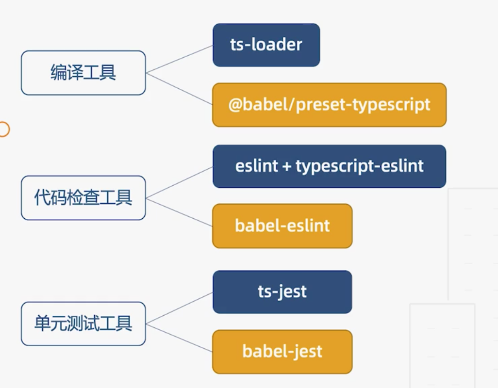
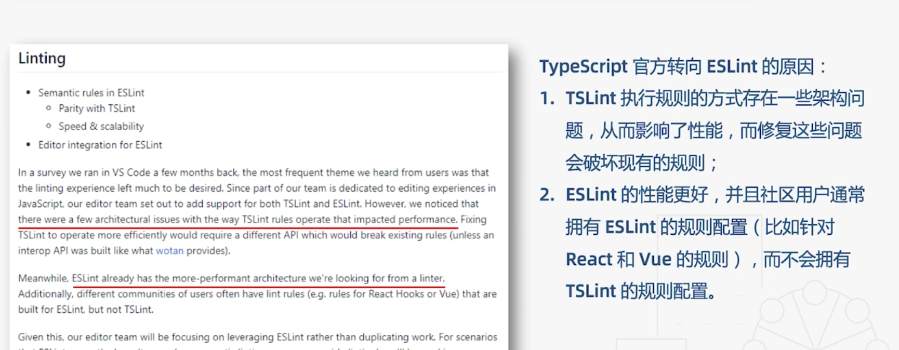
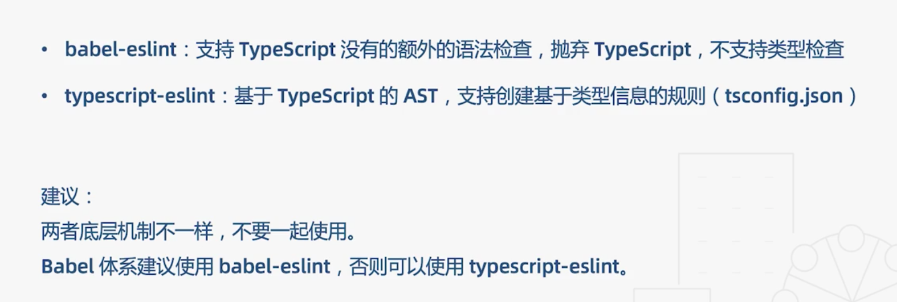

# 第五篇： 工程化(二)

[toc]

## 工程引用

使用场景: 在一个大型项目中，可能会有很多子项目,这些项目还会有一些相互的引用。

1. 单独构建某个子项目

2. 文件结构调整

3. 库类独立打包缓存

```sh
├── src
│   ├── client
│   │   └── index.ts
│   ├── common
│   │   └── index.ts
│   ├── index.ts
│   └── serve
│       └── index.ts
├── test
│   ├── client.test.ts
│   └── server.test.ts
└── tsconfig.json
```

```json
{
  "compilerOptions": {
    "outDir": "./dist",
    "strict": true
  }
}
```

打包到 `dist` 。

1. 无法单独打包某个项目

2. `src` 文件结构冗余
3. `common` 每次都要打包一次

```sh
├── src
│   ├── client
│   │   └── index.js
│   ├── common
│   │   └── index.js
│   ├── index.js
│   └── serve
│       └── index.js
└── test
    ├── client.test.js
    └── server.test.js
```

### 改造配置

- 将大配置拆解为一个基础配置和四个小配置

```sh
├── src
│   ├── client
│   │   ├── index.ts
│   │   └── tsconfig.json
│   ├── common
│   │   ├── index.ts
│   │   └── tsconfig.json
│   ├── index.ts
│   └── serve
│       ├── index.ts
│       └── tsconfig.json
├── test
│   ├── client.test.ts
│   ├── server.test.ts
│   └── tsconfig.json
└── tsconfig.json # 基础配置
```

` composite`  `declaration` 是一个被引用工程文件所**必须的**。

```json
// 基础配置
{
  "compilerOptions": {
    "outDir": "./dist",
    "strict": true,
    "composite": true, // 工程可以被引用并增量编译
    "declaration": true // 生成声明文件
  }
}
```

- 其他小工程的配置

`extends`: 继承基础配置

`references`: 指定依赖的工程

```json
// serve/tsconfig.json
{
  "extends": "../../tsconfig.json",
  "compilerOptions": {
    "outDir": "../../dist/serve"
  },
  "references": [{
    "path": "../common"
  }]
}
```

执行命令 `tsc -b src/serve --verbose`

构建工程需要使用 `-b` 参数

`--verbose` 可以打印出相关构建信息

- 重构工程后的`dist` 结构

```sh
├── client
│   ├── index.d.ts
│   ├── index.js
│   └── tsconfig.tsbuildinfo
├── client.test.d.ts
├── client.test.js
├── common
│   ├── index.d.ts
│   ├── index.js
│   └── tsconfig.tsbuildinfo
├── serve
│   ├── index.d.ts
│   ├── index.js
│   └── tsconfig.tsbuildinfo
├── server.test.d.ts
├── server.test.js
└── tsconfig.tsbuildinfo
```

## 编译工具



### ts-loader

主要做两件事情：

1.类型检查

2.语言转换

随着项目越来越大，`1` 的时间会越来越长。

有两种方案可以解决：

#### 自带方案

通过配置`transpileOnly: true` + `fork-ts-checker-webpack-plugin` 插件将类型检查放到另一线程

```js
// const ForkTsChecker = require('fork-ts-checker-webpack-plugin')
module: {
  rules: [
    {
      test: /\.tsx?$/i,
      use: [{
        loader: 'ts-loader',
        options : {
          // 只做语言转换，不做类型检查
          transpileOnly: true
        }
      }],
      exclude: /node_modules/
    }
  ]
},
  plugins: [
    new HtmlWebpackPlugin({
      template: 'index.html'
    }),
    new ForkTsChecker()
  ]
```

#### 使用 awesome

与 `ts-loader` 差不多，更适合集成 `babel`

但是类型检查会有遗漏，没有 `ts` 精确

```js
// const {CheckerPlugin} = require('awesome-typescript-loader')
module: {
  rules: [
    {
      test: /\.tsx?$/i,
      use: [{
        // loader: 'ts-loader',
        loader: 'awesome-typescript-loader',
        options : {
          // 只做语言转换，不做类型检查
          transpileOnly: true
          // fork-ts-checker-webpack-plugin
        }
      }],
      exclude: /node_modules/
    }
  ]
},
  plugins: [
    new HtmlWebpackPlugin({
      template: 'index.html'
    }),
    // new ForkTsChecker()
    new CheckerPlugin()
  ]
```

### babel

`ts-loader` 和 `babel` 都可以直接转换 `ts` 代码

 但`babel` 不能做类型检查, 并且有以下 4 点语法不支持:

1. `namespace`
2. 常量枚举
3. 断言
4. `export = X`


构建一个项目有两个选择:

1. 放弃使用 `babel` , 只使用`ts-loader`
2. 使用`babel` , 并安装`typescript` 执行一个额外的脚本来类型检查

```
npm i typescript -D
tsc --init
```

配置`tsconfig.json` 的`noEmit: true`

执行额外脚本`tsc --watch`

### 代码风格检查



`ts-lint` 已经被官方抛弃, 只学习`es-lint`即可。

项目集成也是分为两个方案：

1. 使用  `typescript-eslint` 官方提供的插件, 搭配`vscode` `es-lint` 插件使用

2. 使用 `babel-eslint`



### 单元测试

`jest`  `ts-jest`

```
npx ts-jest config:init
```

